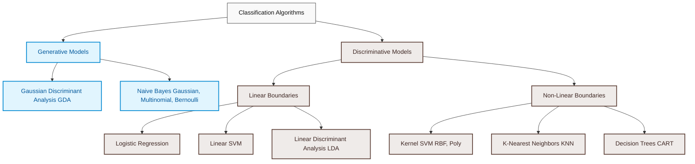

# Phase 8: Classification Algorithms

The most used ML algorithms in industry.

## 📚 Topics

| Order | Topic | Domain | Status |
|---|---|---|---|
| 1 | [Linear vs Logistic Regression](./01_linear_vs_logistic_regression.ipynb) | Classification Intro | ✅ Completed |
| 2 | [Stanford CS229 Lec 3: Logistic Regression math](./02_stanford_cs229_lec_3_logistic_regression_math.ipynb) | Stanford CS229 | ✅ Completed |
| 3 | [Logistic Regression full series: Perceptron, Sigmoid, Loss, GD](./03_logistic_regression_full_series_perceptron_sigmoid_loss_gd.ipynb) | Logistic Regression | ✅ Completed |
| 4 | [Logistic Regression with Python](./04_logistic_regression_with_python.ipynb) | Logistic Regression | ✅ Completed |
| 5 | [Logistic Regression solved numerical](./05_logistic_regression_solved_numerical.ipynb) | Logistic Regression | ✅ Completed |
| 6 | [Logistic Regression hyperparameters](./06_logistic_regression_hyperparameters.ipynb) | Logistic Regression | ✅ Completed |
| 7 | [Binary Classification: full implementation](./07_binary_classification_full_implementation.ipynb) | Classification Implementation | ✅ Completed |
| 8 | [Stanford CS229 Lec 4: Perceptron and GLM](./08_stanford_cs229_lec_4_perceptron_and_glm.ipynb) | Stanford CS229 | ✅ Completed |
| 9 | [Softmax / Multinomial Logistic Regression](./09_softmax_multinomial_logistic_regression.ipynb) | Multiclass Classification | ✅ Completed |
| 10 | [Multiclass Classification: One vs All, One vs One](./10_multiclass_classification_one_vs_all_one_vs_one.ipynb) | Multiclass Classification | ✅ Completed |
| 11 | [Confusion Matrix, Accuracy, Type 1 & 2 errors](./11_confusion_matrix_accuracy_type_1_2_errors.ipynb) | Classification Metrics | ✅ Completed |
| 12 | [Precision, Recall, F1 Score](./12_precision_recall_f1_score.ipynb) | Classification Metrics | ✅ Completed |
| 13 | [ROC AUC full](./13_roc_auc_full.ipynb) | Classification Metrics | ✅ Completed |
| 14 | [Specificity and Sensitivity](./14_specificity_and_sensitivity.ipynb) | Classification Metrics | ✅ Completed |
| 15 | [Multiclass Confusion Matrix](./15_multiclass_confusion_matrix.ipynb) | Classification Metrics | ✅ Completed |
| 16 | [Accuracy vs F1 Score](./16_accuracy_vs_f1_score.ipynb) | Classification Metrics | ✅ Completed |
| 17 | [Dataset imbalance and remedies: Augmentation](./17_dataset_imbalance_and_remedies_augmentation.ipynb) | Imbalanced Data | ✅ Completed |
| 18 | [Conditional Probability](./18_conditional_probability.ipynb) | Probability Basics | ✅ Completed |
| 19 | [Bayes Theorem](./19_bayes_theorem.ipynb) | Probability Basics | ✅ Completed |
| 20 | [Stanford CS229 Lec 5: GDA and Naive Bayes](./20_stanford_cs229_lec_5_gda_and_naive_bayes.ipynb) | Stanford CS229 | ✅ Completed |
| 21 | [Naive Bayes full series](./21_naive_bayes_full_series.ipynb) | Naive Bayes | ✅ Completed |
| 22 | [Naive Bayes variants: Bernoulli, Multinomial, Gaussian](./22_naive_bayes_variants_bernoulli_multinomial_gaussian.ipynb) | Naive Bayes | ✅ Completed |
| 23 | [Naive Bayes solved numerical](./23_naive_bayes_solved_numerical.ipynb) | Naive Bayes | ✅ Completed |
| 24 | [Bayesian Belief Network](./24_bayesian_belief_network.ipynb) | Bayesian Networks | ✅ Completed |
| 25 | [Bayes Optimal Classifier](./25_bayes_optimal_classifier.ipynb) | Bayesian Learning | ✅ Completed |
| 26 | [Concept Learning](./26_concept_learning.ipynb) | Machine Learning Theory | ✅ Completed |
| 27 | [Stanford CS229 Lec 6: SVM](./27_stanford_cs229_lec_6_svm.ipynb) | Stanford CS229 | ✅ Completed |
| 28 | [SVM geometric intuition](./28_svm_geometric_intuition.ipynb) | SVM | ✅ Completed |
| 29 | [SVM hard margin and soft margin math](./29_svm_hard_margin_and_soft_margin_math.ipynb) | SVM | ✅ Completed |
| 30 | [Stanford CS229 Lec 7: Kernels](./30_stanford_cs229_lec_7_kernels.ipynb) | Stanford CS229 | ✅ Completed |
| 31 | [Kernel trick and Non linear SVM](./31_kernel_trick_and_non_linear_svm.ipynb) | SVM | ✅ Completed |
| 32 | [SVM implementation](./32_svm_implementation.ipynb) | SVM | ✅ Completed |
| 33 | [Decision Tree intuition and Entropy and Info Gain](./33_decision_tree_intuition_and_entropy_and_info_gain.ipynb) | Decision Trees | ✅ Completed |
| 34 | [ID3, C4.5, CART algorithms](./34_id3_c4_5_cart_algorithms.ipynb) | Decision Trees | ✅ Completed |
| 35 | [Decision Tree hyperparameters and overfitting](./35_decision_tree_hyperparameters_and_overfitting.ipynb) | Decision Trees | ✅ Completed |
| 36 | [Decision Tree visualization](./36_decision_tree_visualization.ipynb) | Decision Trees | ✅ Completed |
| 37 | [Decision Tree implementation](./37_decision_tree_implementation.ipynb) | Decision Trees | ✅ Completed |
| 38 | [KNN Classification and finding K](./38_knn_classification_and_finding_k.ipynb) | KNN | ✅ Completed |
| 39 | [KNN full overview](./39_knn_full_overview.ipynb) | KNN | ✅ Completed |
| 40 | [Linear Discriminant Analysis (LDA)](./40_linear_discriminant_analysis_lda.ipynb) | Linear Discriminant | ✅ Completed |
| 41 | [Inductive Bias](./41_inductive_bias.ipynb) | Machine Learning Theory | ✅ Completed |

## 🗺️ Classification Algorithm Map

Below is a visual taxonomy map of the classification models covered in this phase:

## 🛠️ Projects

Completed projects in this phase:
- [Titanic_Survival_Predictor](./Projects/Titanic_Survival_Predictor)
